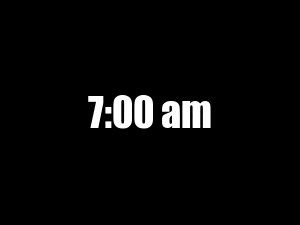

```{r setup, include=FALSE}
knitr::opts_chunk$set(echo=TRUE, message=FALSE, warning=FALSE, error=FALSE)
library(magick)
```

```{css}
body{
  background-color:rgb(117 190 218 / 20%);
  font-family: serif;
}

h1, h2, h3, h4 {
  font-weight: bold;
}

p {
  font-family: cursive;
  font-size: 18px;
}
```

## Project requirements

**1. Setting up a GitHub account, create a new repository called “stats220”, a README.md file in the repository "stats220", and write some information about the purpose of the report in README.md file by the Markdown syntax.
There are my links to my [repository](https://github.com/YuekunElla/STAT220.git) and to my [website](https://yuekunella.github.io/STAT220/).**


**2. This is my project folder**


**3. Create the new meme(an image and an animation) by changing some features of inspo_meme(a picture of two cats).**

* Using some functions e.g. `c()`, `image_blank()`, `image_read()`, `image_annotate()`, `image_append()`, `image_animate()`,  `image_write()`, `image_rotate()`.

* Using pipes e.g. `%>%`

* Using named objects e.g. `meme <- image_read(url)`

* Using comments e.g. `#note to self`

* Using indenting and "white space"
  
**4. Create a HTML report**

## My meme
```{r meme-code, eval=TRUE}
# Creating a meme
# The part of cats (Your cats wakes you up when 7:00am because they're hungry)
hungry_cat <- image_read("https://www.mypetsies.com/blog/app/uploads/2016/09/edfsaf.jpg") %>%
  image_scale(300) %>%
  image_annotate("Where's breakfast?",
                 font = "Impact", 
                 size = 30, 
                 color = "white", 
                 degree = -20, 
                 location = "+10+80")

# The part of time_part
time_text <- image_blank(width = 300, 
                         height = 200, 
                         color = "#000000") %>%
  image_annotate("7:00 am", 
                 color = "#FFFFFF", 
                 size = 40, 
                 font = "Impact", 
                 gravity = "center")

# Making the whole meme
meme <- c(time_text, hungry_cat) %>%
  image_append(stack = TRUE)

# Save the meme as the image file
meme %>% 
  image_write("my_meme.png")

meme
```


```{r animation-code, eval=FALSE}
# Creating my animation
# creating basic picture for frame1 to frame4
cat_image <- image_read("https://www.mypetsies.com/blog/app/uploads/2016/09/edfsaf.jpg") %>%
  image_scale(300)

# creating each frame
time_picture <- image_blank(width = 300, 
                         height = 225, 
                         color = "#000000") %>%
  image_annotate("7:00 am", 
                 color = "#FFFFFF", 
                 size = 40, 
                 font = "Impact", 
                 gravity = "center")

frame1 <- hungry_cat
  
frame2 <- cat_image %>%
  image_flop()  %>%
  image_annotate("Wake up!!!",
                 font = "Impact", 
                 size = 30, 
                 color = "white", 
                 degree = +10, 
                 location = "+150+40")

frame3 <- cat_image %>%
  image_rotate(180) %>%
  image_annotate("MORNING!",
                 font = "Impact", 
                 size = 30, 
                 color = "white", 
                 degree = -20, 
                 location = "+150+150")

frame4 <- cat_image %>%
  image_annotate("Hi,Mom",
                 font = "Impact", 
                 size = 30, 
                 color = "white", 
                 degree = -20, 
                 location = "+40+60")

# putting the frames in order using a vector
frames <- c(time_picture, frame1, frame2, frame3, frame4)

# creating an animation
my_animation <- image_animate(frames, fps = 1) 

# save as image file
image_write(my_animation, "my_animation.gif")

```


## Creativity
* When using the function of `image_annotate`, using `location=+150+150` and `degree:+10` instead of `gravity:center`,in order to put the text into image deftly.

* When making the animation, using additional functions from the {magick} package, e.g `image_flop()`,`image_rotate(180)` , in order to flip the image of cat.

* In the CSS chunk, changing the background color using `background-color:rgb(117 190 218 / 20%)`


## Learning reflection

From the Module 1 Creating HTML by combining modern technologies, I learned how to set up my GitHub and share my work on GitHub pages and how to use Markdown to create HTML for web pages. In addition, I identified key syntax features of R code and learned a lot of functions in R package {magick}, e.g.`c()`, `image_blank()`, `image_read()`, `image_annotate()`, `image_append()`, `image_animate()`, `image_flop()`, `image_write()`, `image_rotate()`. Moreover, I learned how to change the visual appearance of my report by CSS and learned main parts of a R Markdown document, e.g.YAML, r setup chunk, Markdown syntax, knitting to HTML.

In the future, I want to explore and learn more functions of different R packages and more CSS syntax that making more creative works.


