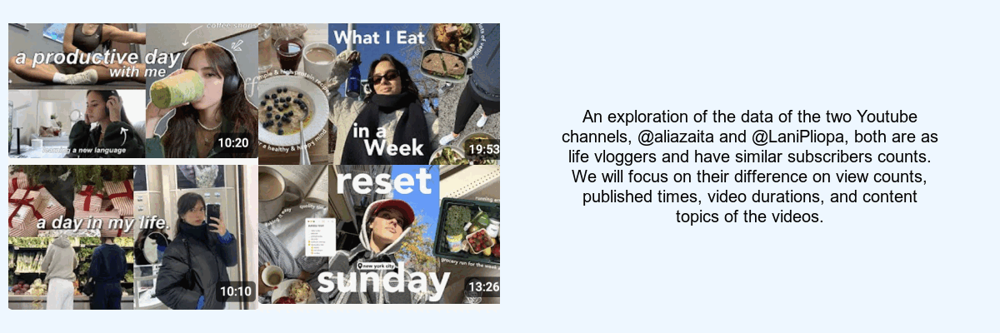

```{r setup, include=FALSE}
knitr::opts_chunk$set(echo=TRUE, message=FALSE, warning=FALSE, error=FALSE)
library(magick)
library(tidyverse)
```

```{css, echo=FALSE}
body{
  background-color:rgb(117 190 218 / 20%);
  font-family: serif;
}

h1, h2, h3, h4 {
  font-weight: bold;
}

p {
  font-family: cursive;
  font-size: 12pt;
}

```

## Introduction

**I choose @aliazaita and @LaniPliopa as the two Youtube channel to explore, as they are two vloggers I subscribed, have similar amount of subscribers, 465K subscribers and 395K subscribers, respectively and are both lifestyle volgger.**

**Two ideas that I had before I accessed the data for visualisations:**

1.  I want to compare video duration time distribution of the two channel
2.  And I want to compare the common themes or elements in their videos titles of the two channel.

**Process of creating my data visualisations:**

1.  I decide to focus on the views count which is important to every channel, and I want to explore if there are some factors can influnce it, such as duration time and published time. And I focus on the top 10 common words in titles in each two channels, as I want to find some similarities and differences on the content of videos by two channel.
2.  I chose geom_bar to anlysis the top ten common words in each channel video title, as it can show the amount of each top common word clearly and also show the amount difference explicitly. And I also chose the geom_boxplot to show the difference of video duration in different levels of views, as it can show the distribution of video duration time in different levels of views explicitly.
3.  I tried to use `geom_point` + `geom_smooth` to find a relationship between the duration time and views count, but I did not find some explicit relationships.

## Dynamic data story

On the title slide, I chose 4 screenshots from the alia zaita and Lani Pliopa channels and composited them together using `image_append()`. For data visualisations, I used different different geom, such as
`geom_boxplot()`,`geom_bar()`,`geom_density()` and `geom_jitter()`. On the final slide, I also add a meme to make the story more interesting.

## Learning reflection
From the Module 4: Creating static and dynamic visualisations, I learned to how to use `geom_layer(s)`,
the `aes()` function, `scale_layers()`,`facet_wrap()`, such as `geom_layer(s)` is to visualise the data points by using different shapes, `aes()` maps variables from your data to axes, positions, colours, size, shape, etc., `facet_wrap()` creates subplots for your visualisation, also referred to as "small multiples", `scale_layers()` adjusts the scales used to visualise the data, including colour and other "visual" scales, etc., `labs()`adds labels to your visualisation, and `guides()` modifies legends (guides) e.g. change position, don't show them.

In the future, I want to learn more about how to analyse the data using some packages and fuctions on the {ggplot2} on the R.

## Appendix
```{r file='visualisations.R', eval=FALSE, echo=TRUE}

```

```{r file='data_story.R', eval=FALSE, echo=TRUE}

```
